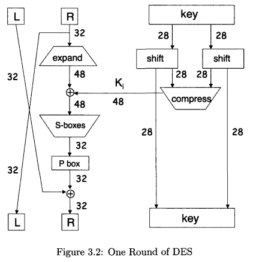

# Common Principles
###### Kerckhoffs' Principle
> Inner workings of a cryptosystem are completely known to the attacker, and the only secret is a key.
###### Definitoin of Secure
> We say that a cryptosystem is **secure** if the best-known attack requires as much work as an exhaustive key search. In other words, no shortcut attack is known.
###### Confusion vs Diffusion
* **Confusion** is a obscuring relationship between key & plaintext and between key & ciphertext. The use of confusion makes it possible to design the key in a way that even if the attacker has part of the key, it will not be possible to deduce the other part of the key.
	* Ciphertext has no info about plaintext or it is complicated
* **Diffusion** is to evenly distribute statistics of the plaintext to ciphertext .
# Symmetric Encryption
### One-time pad
Message => sequence of bits in ASCII => xor random key = ciphertext
* (-) The key must be used only once!
* (-) The length of the key equals to the length of the message => the length of the message must be pre-shared, but what are the reason then?
### Block & Stream ciphers
#### Stream
* Similar to one-pad (plaintext $\oplus$ key_stream = ciphertext)
* (+) can be used in **hardware** (A5/1)
* (+) are better for **wireless devices**, severely resource-constrained devices, and extremely high data-rate systems (because stream ciphers are protected by single-bit error by design)
* (+) **greater** performance
* (+) solve **confidentiality** problem = encrypt for transmission over insecure channel & encrypt to store data on insecure media
* (+) solve **integrity** problem
* (-) is a **confusion** only
* (-) old-fashioned but **not dead**!
* (-) typically it is necessary to generate a sequential keystream starting from the **beginning** of the plaintext stream (**bad** for 1MB message with a need to decrypt only the last 1KB). Can be solved with CTR
###### A5/1
* hardware-based => faster but now meaningless
* bit-based
* 3 shift registers: X, Y, Z
* used in GSM, for data rate systems (audio)
###### RC4
- software-based and simple
- byte-based
- lookup table with permutation of {1, ..., 256} which changes after each generation of a key_stream byte
- optimised for old 8-bit processors
- used in SSL & WEP
#### Block
* (+) supports both **confusion** and **diffusion**
* (+) **modern** and widely used
* (+) replace stream ciphers in the majority of areas
* (+) more **versatility**: anything you can do with a stream cipher can also be done with a block cipher in a suitable mode
* (+): often some algorithms (e.g. AES) are **supported by CPU** design => faster performance than any software-based cipher
* (+): some algorithms allow to **encrypt any block** of plaintext and decrypt any (1MB message with a need to decrypt only the last 1KB)
* (-): **less** performance
* (-): often are not applicable in high data-rate systems due to performance and handling single-bit errors
- **Idea**: split plaintext into fixed-sized blocks and generate fixed-sized blocks of ciphertexts
- Contains round function $F$ and a key $K$
- Typically trade-off between complexity of round function $F$ and number of rounds
###### Modes
* **ECB (electronic code book)**: If plaintext blocks are encrypted like this: $C_{i} = E(P_i, K)$, then:
	
	*  (-) Does not solve the problem with changing the order of ciphertext blocks (Trudy got 1000$ while Alice only 2$)
* **CBC (cipher block chaining)**: $C_{i} = E (P_{i} \oplus C_{i-1}, K)$ and $C_{0}=E(P_{0} \oplus IV, K)$
	* $IV$ randomly generated and send as the 1st "ciphertext" block.
		
	* (+) Helps to solve data **integrity** problem - MAC
	* (+) If single bit error occurs plaintext may be unrecoverable, but in fact only two blocks of the plaintext are affected
		
	* (-) However, only 1 single-bit error affect already 2! blocks of the plaintext **which is not acceptable** in high error-rate envs such as wireless => there stream ciphers are preferred
	* (-) Does not solve the problem with changing the order of ciphertext blocks (Trudy got 1000$ while Alice only 2$).
- **СTR (counter)**: need to generate stream cipher keystream using block cipher: $C_i=P_{i} \oplus E(IV + i, K)$
	- Often used for a random access because CBC is some cases is not desirable
###### Feistel Cipher
* a general block cipher **design principle**, not a specific cipher
* the key point is that any Feistel Cipher is invertible by design
* split plaintext to two parts: $P=(L_{0}, R_{0})$
* for each round $i = 1,2,...,n: L_{i} = R_{i-1} \text{ and } R_{i} = L_{i - 1} \oplus F(R_{i-1}, K) \implies C=(L_{n}, R_{n})$
* $F(R_{i-1}, K_{i}) = ..$
* the main concern is a **function** and rarely key
###### DES (Data Encryption Standard)
* 
- based on **Lucifer cipher** (Feistel devloped at IBM)
- however, DES has $2^{56}$ key variants only but was strengthen then in other terms with the help of S-boxes
- today DES is vulnerable because of small key length
- balance between complexity of $F$ and number of rounds
- Characteristics:
	- $16$ rounds
	- $64$ bit block length
	- $56$ bit key
	- $48$ bit subkeys
	- $8$ s-boxes mapping 6 bits to 4 bits
###### 2DES
* $C = E(E(P, K_{1}), K_{2})$ or applying `DES` 2 times
* (+) 112 key length = `len(K1)` + `len(K2)`
* attacker can pre-compute a table of size $2^{56}$ containing the pair $E(P,K) \text{ and } K$ for all possible values K
* building a table of $2^{56}$ is difficult but it is a one-time task and is amortized over the number of attacks
* (-) Neglecting pre-computing the table, overall work is expected to be $2^{55}$ just as in exhaustive key search attack on **1DES**
* (-) `1DES = 2DES` to break
* a method to break `2DES` as `1DES` is called meet-in-the-middle
###### 3DES
- $C = E(D(E(P,K_{1}),K_{2}),K_{1})$
- **2 keys only** are used (since 112 bits is sufficient)
- **3** keys does not add much security, so **2** is okay
- `3DES` collapses to `1DES` $\text{if } K1 = K2$
* Since table now must be built per each attack, that work is infeasible, and `exhaustive key search` or `meet-in-the-middle` are infeasible 
* fading away because of **AES**
###### AES
- is a Rijndael algorithm
- not a Feistel Cipher => invertible operations must be supported
- has highly mathematical structure
- complex $F$ but small number of rounds
- supports random-access and random-encrypt: any block of Plaintext can be encrypted without any knowing about previous blocks
- Characteristics:
	- $128$ bit block length (actually `4x4` byte array)
	- $\{128, 192, 256\}$ bit keys available
	- $10..14$ rounds depending on the key length
- 4 basic functions and layers:
	- `ByteSub` (nonlinear layer) - lookup table for each byte
	- `ShiftRow` (linear mixing layer) - circular shift of each row (1st -> 0, 2nd -> 1, 3rd -> 2)
	- `MixColumn` (nonlinear layer) - lookup table for each column
	- `AddRoundKey` (key addition layer) - xor to subkey 
- All of these functions are **invertible**
###### IDEA (International Data Encryption Algorithm)
- mixed mode arithmetic: addition modulo $2$ + addition modulo $2^{16}$ and multiplication modulo $2^{16}$
###### Blowfish
- key dependent S-boxed instead of fixed
###### RC6
- RSA + RC4 + MD5 hashing
- data-dependent rotations (highly unusual to rely on the data as an essential part of the operation of a crypto algorithm)
###### TEA (Tiny Encryption Algorithms)
* 
- simple
- based on `32` bit computer architecture (32 bit words)
- simple $F$ but large number of rounds
- not a Feistel Cipher, but really close (use $+$ and $-$ instead of $\oplus$)
- weak if: two messages are encrypted with the somehow related keys (low probability) - XTEA solves the problem
- Characteristics:
	- `64` bit block length
	- `128` bit key
	- `32` rounds typically considered as secure (which is ~ almost as 64 round in DES)
###### MAC (Message Auth Code)
* Uses a block cipher to ensure data integrity
* Procedure: encrypt data in CBC mode discarding all ciphertext blocks except the final one = MAC.
* Shared symmetric key is required for encryption = but rather say for MAC
* Crucial property of CBC in MAC:
	* **Change in ciphertext** block affects only 2 recovered plaintext blocks.
	* But **change in plaintext** propogates an error to the final block.
* (-): needs another one encryption to keep both **integrity** and **confidentiality**, or the encryption with the same key, but last blocks will be duplicated ($C_n$ and MAC)
# Public Key Cryptography
* (-) **Performance**: slower then symmetric
* (+) **Confidentiality**: OK as in symmetric
* (+) **Integrity**: OK with **digital signature** as in symmetric with **MAC**
* (++) **Non-repudiation**: OK and unique to asymetric (MAC does not help here). With shared key message can be forged by one of the sides!
## PKI
* **Certificate** (simplified) = Name + Public Key. For example Alice's certificate:
	* $M$ = ("Alice", Alices' public key) and $S=[M]_{CA}$
* If you trust the CA, you believe that it actually gave the private key to Alice, and not to anyone else
* **Certificate revocation** is possible (distribute to users updates list of certificate revocation lists) to filter our compromised certificates
* PKI models: monopoly, oligarchy, anarchy

## Ciphers
### Knapsack public key
* (+) simple
* (-) insecure since of "lattice reduction" attack (1983). The generated knapsack is not really the "general knapsack", but some specific well-structured case
* (-) there are variants that are secure today, but they are tainted forever
###### General Knapsack
* **Given**: Weights $W_{0}, W_{1}, \dots, W_{n-1}$ and desired sum $S$
* **Find**: Coefficients $a_0, a_1, \dots a_{n-1}$ , where $a_{i} \in {0, 1}$so that
	* $S = a_{0}W_{0} + a_{1}W_{1}+\dots+a_{n-1}W_{n-1}$
* Solution: NP-complete
###### Super-increasing Knapsack
* **Given**: The same but weights are sorted so that each next weight is greater than the sum of the previous: $W_{i} > \sum_{j=1}^{i-1}{W_{j}}$
	* Example: 3, 6, 11, 25, 46, 95, 200, 411
* **Solution**: As far as $W_i < \text{current sum}$  take $W_i$
##### How to encrypt/decrypt?
* Public key = general knapsack + conversion factors
* Private key = super-increasing knapsack
###### Encryption:
1. Generate a superincreasing knapsack. (private key = )
	(2,3,7,14,30,57,120,251)
2. Choose conversion factors
	m = 41, n = 491
3. Convert to general knapsack:
	
4. The public key is general knapscak
	(82,123,287,83,248,373,10,471)
5. The private key is the superincreasing knapsack together with the multiplicative inverse of the conversion factor, i.e., $m^{-1} \mod n$
	(2,3,7,14,30,57,120,251) and  $41^{-1} \mod 491 = 12$    since   $(41 * 12) \mod 491 = 492 \mod 491 = 1$
###### Decryption	

### RSA (Rivest Shamir Adleman)
* Based on Euler's Theorem:
	
* Prime numbers (`p` and `q`) must be large
* In real world $N$ is at least $1024$ bits. Often $2048$ bits.
* Forward search attack (guess plaintext message) is possible => private key can obtained => necessary to use padding (набивка) with random bits
* **Repeated Squaring** (binary exponentiation) can be used to speed up exponentiation process
* Speed up with the same exponent `e`, and avoiding attacks with padding
##### How to encrypt/decrypt?
###### Encryption
1. Choose 2 large **prime** numbers $p$ and $q$ 
2. Form their product $N=p*q$
3. Choose $e$ relatively prime (GCD=1) to the product $(p-1)(q-1)$
4. Find $d = e^{-1} \mod (p-q)(q-1)$, so that $ed \mod (p-1)(q-1) = 1$
* $N$ is **modulus**
- $e$ is **encryption exponent**
- $d$ is **decryption exponent**
- **Public key**: $(N, e)$
* **Private key**: $d$
5. Encrypt: $C = M^{e} \mod N$, where $M$ is the plaintext message
6. Decrypt: $M = C^d \mod N$
### Diffie-Hellman
- based on **discrete log problem** (NP-complete)
- DH is not for encrypting or signing, but to stablish a shared symmetric key
- $x = g^k \implies k = \log_{g}{x}$. The same is for discrete: $x = g^k \mod p$,    $p$   is prime
- **Public key**: `g` and `p`
- (-): suspectible for MITM - to solve it we should either encrypt the DH exchange with shared / public keys or sign the DH values with private
* 
### Elliptic Curve Cryptography

### ECC DH

# Hashing
Cryptographic has function must provide all:
* **Compression**: for any size input `x`, the output length of `y = h(x)` is smalland often fixed.
* **Efficiency**: easy to compute `h(x)` for any `x`
* **One-way**: no feasible fay to invert the hash
* **Weak collision resistance**: given `x` and `h(x)` it is infeasible to find any `y`, such that `h(y) = h(x)` and `y != x`
* **Strong collision resistance**: infeasible to find any `x` and `y`, such that `x != y` and `h(x) = h(y)`.