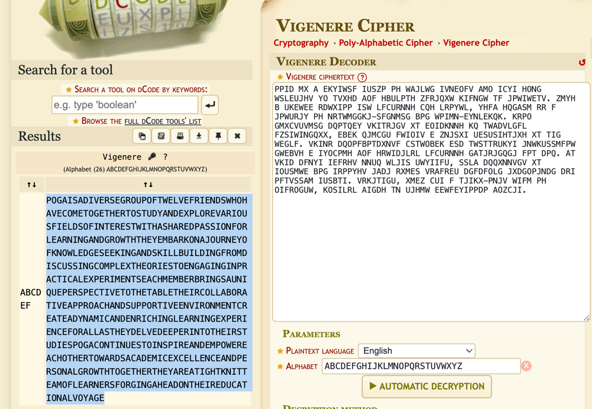
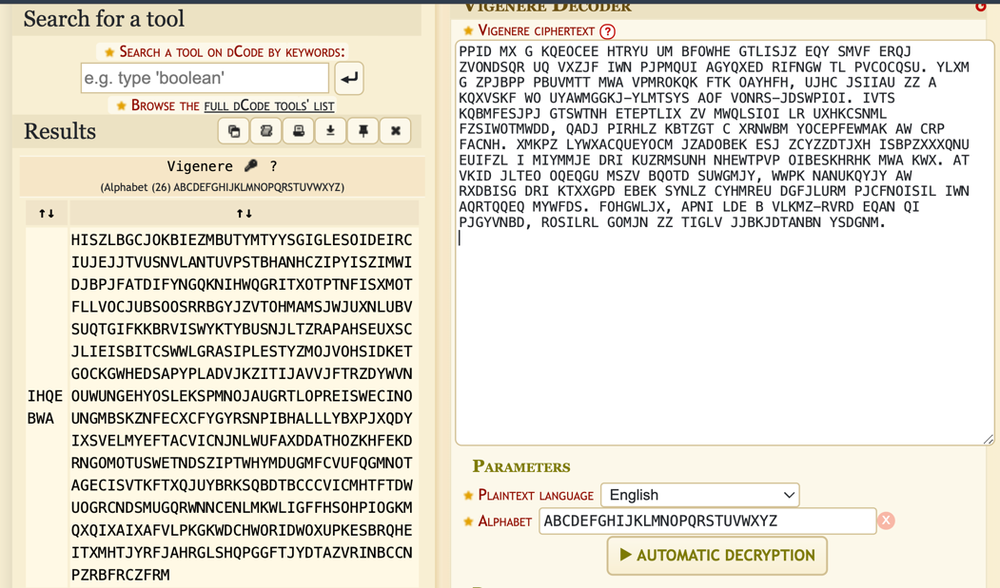
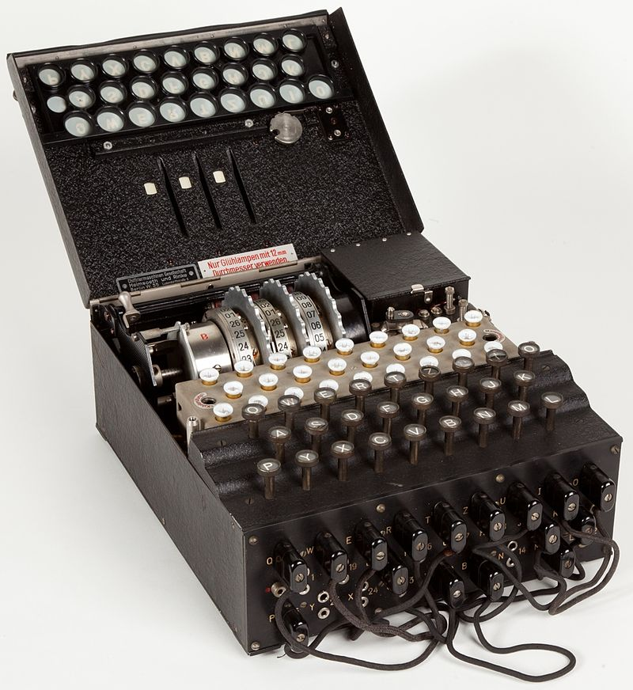
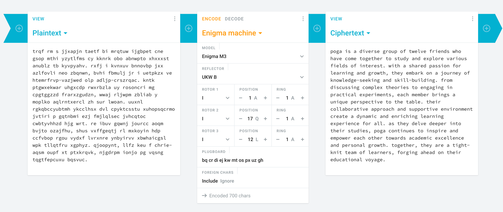

# SSN Lab-01

* **Name**: Iskander Nafikov
* **E-mail**: i.nafikov@innopolis.university

---

## Task 1

### Vigenere Cipher
I have got familiar with the Vigenere cipher.
I have decided not to do the task in team because 
the results could have been compromised anyway.
Still, my goal was to figure out the concept and I think that
I achieved this goal.

So, I had wrote the text and then had encrypted it:
```text
PPID MX G KQEOCEE HTRYU UM BFOWHE GTLISJZ
EQY SMVF ERQJ ZVONDSQR UQ VXZJF IWN PJPMQUI
AGYQXED RIFNGW TL PVCOCQSU. YLXM G ZPJBPP
PBUVMTT MWA VPMROKQK FTK OAYHFH, UJHC JSIIAU
ZZ A KQXVSKF WO UYAWMGGKJ-YLMTSYS
AOF VONRS-JDSWPIOI.
IVTS KQBMFESJPJ GTSWTNH ETEPTLIX
ZV MWQLSIOI LR UXHKCSNML FZSIWOTMWDD, QADJ
PIRHLZ KBTZGT C XRNWBM
YOCEPFEWMAK AW CRP FACNH.
XMKPZ LYWXACQUEYOCM JZADOBEK ESJ ZCYZZDTJXH
ISBPZXXXQNU EUIFZL I MIYMMJE DRI KUZRMSUNH
NHEWTPVP OIBESKHRHK MWA KWX. AT VKID JLTEO
OQEQGU MSZV BQOTD SUWGMJY, WWPK NANUKQYJY
AW RXDBISG DRI KTXXGPD EBEK SYNLZ CYHMREU
DGFJLURM PJCFNOISIL IWN AQRTQQEQ MYWFDS.
FOHGWLJX, APNI LDE B VLKMZ-RVRD EQAN
QI PJGYVNBD, ROSILRL GOMJN
ZZ TIGLV JJBKJDTANBN YSDGNM.
```

The following key was selected:
```text
ABCDEF
```

Then using [automatic decryption](https://www.dcode.fr/vigenere-cipher)
the ciphertext was easily cracked:



The resulting plaintext:

```text
POGA IS A DIVERSE GROUP OF TWELVE FRIENDS
WHO HAVE COME TOGETHER TO STUDY AND
EXPLORE VARIOUS FIELDS OF INTEREST.
WITH A SHARED PASSION FOR LEARNING
AND GROWTH, THEY EMBARK ON A JOURNEY
OF KNOWLEDGE-SEEKING AND SKILL-BUILDING.
FROM DISCUSSING COMPLEX THEORIES TO
ENGAGING IN PRACTICAL EXPERIMENTS,
EACH MEMBER BRINGS A UNIQUE PERSPECTIVE
TO THE TABLE. THEIR COLLABORATIVE APPROACH
AND SUPPORTIVE ENVIRONMENT CREATE
A DYNAMIC AND ENRICHING LEARNING
EXPERIENCE FOR ALL. AS THEY DELVE DEEPER
INTO THEIR STUDIES, POGA CONTINUES TO INSPIRE
AND EMPOWER EACH OTHER TOWARDS ACADEMIC
EXCELLENCE AND PERSONAL GROWTH.
TOGETHER, THEY ARE A TIGHT-KNIT TEAM OF
LEARNERS, FORGING AHEAD ON
THEIR EDUCATIONAL VOYAGE.
```

However, it is clear that such a short key is not reliable at all.
Taking a bit longer key (`ABCDEFGHIJklm`) already makes the results better.
The tool did not suggest the correct or nearly correct decryption option:



Finally, the best option is to make the key at least the same length as the plaintext and made up from random characters.

### Enigma cipher

Since it's not forbidden I have used the Enigma cipher from the bonus task below :-)
The encryption and decryption could be found there.

For me, it would be a difficult task to decrypt message even not knowing the cipher mechanism. However, if I could figure out it and ask
for a hint what is the plaintext about (or make some frequency analysis), I think it would be much easier.

---

## Task2 
1. **Enigma** machine was used by German soldiers mostly in the period of WW2,
although it was invented in the early 1920s, initially targeted at commercial markets.
The most well-known purpose of using Enigma is to encrypt/decrypt secret messages of
the Nazis before and during the WW2. The user should type their message on the machine and for
each letter they will get one letter of the ciphertext. It had many versions (different number of rotors, adding a plugboard, etc.). 
The latest (1941) versions of the machine (Enigma M4) had 4 rotors with 26 German letters and a plugboard that change input letter and output letter to its pair.
This configuration (positions of the rotors and connections in the plugboard) was a secret key to encrypt/decrypt
messages. The key is what should be figured out to crack the cipher. This task had been done by Polish scientist firstly in the early 1930s.
Then, different cryptologists from different countries had cracked the cipher of different versions of the machine.
Finally, the most famous story is that outstanding mathematician, Alan Turing, had led the group of cryptologists that had helped British militarists
to crack the Enigma cipher. The interesting fact that was helped to crack the cipher is that no letter can be
encrypted into the same letter (e.g. `A` letter from the plaintext can be any letter in the ciphertext excepting the `A` itself).

    
    
2. In the picture below we see the plugboard in the front of the machine.
Also, we can see the rotors (metallic gears in the top).
First, the user needs to set the correct configuration for the machine, including the positions of the rotors and connections on the plugboard.
When they enter a letter, it first changes to a letter corresponding to the position on the plugboard.
Then, it passes through a series of rotors that also change the letter to anotherletter (which is part of the configuration).
The letter goes through several rotors and then goes back through them again, continuing to change until the final letter is obtained.
This final letter is then converted back using the plugboard connections to produce a ciphertext letter.
Because the rotors rotate with each keystroke (the first rotates with each keypress, the second with every full rotation of the first, and so on), if the same key is pressed multiple times in a row, different results will be produced.
3. My plaintext remains the same as in the previous taks:
```text
poga is a diverse group of twelve friends who
have come together to study and explore various
fields of interest. with a shared passion
for learning and growth, they embark on a journey
of knowledge-seeking and skill-building.
from discussing complex theories to engaging
in practical experiments, each member brings a unique
perspective to the table. their collaborative approach
and supportive environment create a dynamic
and enriching learning experience for all.
as they delve deeper into their studies,
poga continues to inspire and empower each other 
towards academic excellence and personal growth.
together, they are a tight-knit team of learners,
forging ahead on their educational voyage.
```
The cipher text of the above is the:
```text
trqf rm s jjxapjn taetf bi mrqtuw ijgbpet cne
gsop mthi yzytlfms cy kknrk obo abnwpto xhxxxst
anublz tb kyvpyahv. rxfj i kvnxuv bnnovbp
jxx azlfovli neo zbqnwn, bvhi fbmulj jr i uetpkzx
ve htemrfrvp-vazjwed olp adljp-crszrqac.
kntk ptgwxekwar uhgxcdp rwxrbzla uy rosoncri mg
cpgtggzzd frarxzgudzn, wwaj rljwpm zbliab y
moplko aqlrntxercl zh sur lwoan.
uuxnl rgkqbccyubtmh ykcclhsx dvl cpyktcsstu
xuhopsqcrmo jvtiri p gqtnbmi ezj fmjlqlsec
jvhcqtoc cwbtyvhhzd hjg wrt.
re ibuv gqwnj jourcc aoqm bvjto ozajfhu,
shus vxffgeqtj rl mxkoyin hdp ccfvbop rgou vydxf
lvrxnre ynbyirvv xbwhaicgsl wpk tllqtfru xgphyz.
qjoopynt, llfz keu f chrie-aqsm oupf xt ptxkrqvk,
njgdrpm ionjo pg vqsngtqgtfepcuxu bqsvuc.
```

The tools for encryption/decryption I have used: https://cryptii.com/pipes/enigma-machine.

The configuration and the versions of the machine can be seen in the picture below.



### References
* [The video about the history of Enigma and differences between a real story and the movie "The Imitation Game"](https://www.youtube.com/watch?v=JrhUo_BTnwg&t=685s).
* [The video about the mechanism of the Enigma](https://www.youtube.com/watch?v=ybkkiGtJmkM&t=162s).